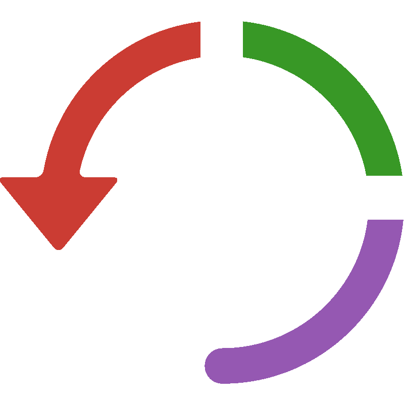

```@meta
CurrentModule = RecurrentLayers
```

<p align="center">
    
</p>

# RecurrentLayers

RecurrentLayers.jl extends [Flux.jl](https://github.com/FluxML/Flux.jl) recurrent layers offering by providing implementations of bleeding edge recurrent layers not commonly available in base deep learning libraries. It is designed for a seamless integration with the larger Flux ecosystem, enabling researchers and practitioners to leverage the latest developments in recurrent neural networks.

## Implemented layers

 - Minimal gated unit as  `MGUCell` [arxiv](https://arxiv.org/abs/1603.09420)
 - Light gated recurrent unit as `LiGRUCell` [arxiv](https://arxiv.org/abs/1803.10225)
 - Independently recurrent neural networks as `IndRNNCell` [arxiv](https://arxiv.org/abs/1803.04831)
 - Recurrent addictive networks as `RANCell` [arxiv](https://arxiv.org/abs/1705.07393)
 - Recurrent highway network as `RHNCell [arixv](https://arxiv.org/pdf/1607.03474)
 - Light recurrent unit as `LightRUCell` [pub](https://www.mdpi.com/2079-9292/13/16/3204)
 - Neural architecture search unit `NASCell` [arxiv](https://arxiv.org/abs/1611.01578)
 - Evolving recurrent neural networks as `MUT1Cell`, `MUT2Cell`, `MUT3Cell` [pub](https://proceedings.mlr.press/v37/jozefowicz15.pdf)
 - Structurally constrained recurrent neural network as `SCRNCell` [arxiv](https://arxiv.org/pdf/1412.7753)

## Contributing

Contributions are always welcome! We look for specifically:
 - Recurrent cells you would like to see implemented 
 - Benchmarks
 - Any bugs and mistakes of course!
 - Documentation, in any form: examples, how tos, docstrings  